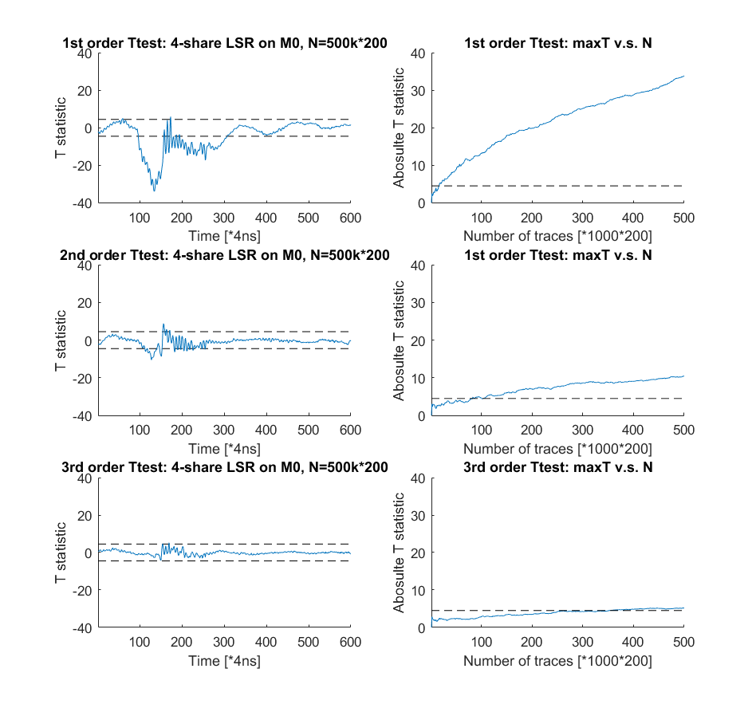

# Share-sliced AES implementation with 16-bit Thumb instructions
This is the code archive of the CHES 2020 paper "Share-slicing: Friend or Foe". The main AES code is from [Virginia Tech's 1st order protected bit-sliced masked AES implementation] \(https://github.com/Secure-Embedded-Systems/Masked-AES-Implementation/tree/master/bitsliced-masked-aes). Originally, the authors used share-slicing, yet with a serial ISW multiplication. Here we choose the parallel mulitplication proposed in [BDF+17] instead. All the AES codes were written in C, except for the masked multiplication was written in Thumb assembly. We do NOT claim security for this implementation: the goal here is merely testing the masked multiplicaton: whether it can achieve the designed security order within this specific implementation setup.

## Slicing style
Following the notations in our CHES paper, when implementing bit-sliced masked implementation, engineers have several choices to make:

- Sbox-wise or Block-wise: in order to take full advantage of the bit-width, engineers usually "borrow" the cocurrent computation blobs: for AES, it can be whether the following Sbox or the following block. Here the implementation would take the following encryption blocks, which is denoted as "block-wise bit-slicing".

- Share-slicing or bit-only-slicing: for the shares of the same bit, engineers can store them all within one register ("share-slicing") or store them as several variables ("bit-only-slicing"). Here the implementation uses share-slicing by default.

## Code Adaption 
Our experimental platform is based on Dr. Daniel Page's SCALE boards with ARM Cortex M0/M3 cores (https://github.com/danpage/scale). Relevant changes including adding the UART communication as well as trigger control, reducing the RAM usage by using a smaller buffer for randomness, etc. As our codes here only use C and 16-bit Thumb, it should cope with most ARM processors.

## Security of share-slicing

Perhaps the key point we wish to remind cryptographic engineers is, [BDF+17] did NOT guarantee security for any speicific implementation platform. Indeed, the authors did NOT even explicitly claim whether this gadget is designed for software or hardware implementations. What is provided in their proof is, if the "indepedent assumption" is statisfied, the security (upto a certain order) can be ensured. Software or hardware, it is the engineer's resposibility to check whether this assumption is true or not. Here, the terminology "assumption" means pre-condition or model requirement: some other cryptographic assumptions sometimes can be intepreted as "cannot/has not got proved, yet likely true, at least not affect security in practice". This one is NOT the case: there is no reason to have a "default yes" belief on it.

On a share-slicing software implementation, the "indepedent assumption" assumes each bit in the processor leaks independently. Conservatively, it can be translated into "no concurrent bit within the bitwidth will interact with other bits". Unless the processor is custmized, satisfying this within a general-purpose processor is not an easy task. Of course, one can still argue that a weaker "indepedent assumption" might still be true: say, the interaction term is way too noise to exploit. Nonetheless, that also means engineers have to quantify noise when implementing this scheme, which is clearly not the workflow we have right now.

In the following, we provide a few experimental results using a different setup than the one in the paper. We stress again that we are merely demonstating the existence of such leakage, not providing evidence for its SNR: therefore, although some experiments have been executed as attacks, they should not been taken as realistic attacks in practice, as the real-life application might add more restrictions.

### Concurrent blocks
We have briefly discussed the options when testing bit-interaction. For instance, for a 4-share scheme, engineers can choose what are the other 28 bits. The most common case in the literature is, setting the other bits to 0:

| x_1 | x_2 | x_3 | x_4 | 0 | ... | 0 |

The issue with this setting is, only 4 bits produce leakage, which gives a low SNR. As a consequence, detecting leakage, even if it does exist, can be quite difficult. On the other hand, it is quite hard to understand why users would force to run a 0 block: in practice, run a random or the same block would not do them any harm. Thus, it is also possible to have the following setting:

| x_1 | x_2 | x_3 | x_4 | y_1 | y_2 | ... |

where the unshared data x=y. The benefit of this setup is the target leakage can accumulate now to achieve a better SNR, although it is still up to the leakage function. However, it is not guranteed to be better, especially for the higher order test, as the sharing of y introduces much noise. The most powerful test should be:

| x_1 | x_2 | x_3 | x_4 | x_1 | x_2 | ... |

This setup gives a better SNR, but at the price of having a few false-positive: in this setting, it is possible to have some interaction from different block, which should not happen in practice. We believe engineers should take this seriously: even if it turns out to be a false warning, it does prove there is a higher order interaction. It did not become a security flaw simply because of the bit-allocation accidently avoid meanful interaction. In my opinion, failing this test is breaking the "indepence assumption" already.

The last one is the most practical, yet we argue one should never use it as a test:
| x_1 | x_2 | x_3 | x_4 | r_1 | r_2 | ... |r_28|

Suppose the attacker has no control on all other concurrent blocks, this is the realistic challenge he or she faces. However, for testing the assumption, this setup has quite low SNR, which makes verifying any assumption difficult. Unless users are looking for a specific application where the attacker is quite restrained, relying on this setup seems to be way too optimistic. 
 
### Repetition
As Picoscope provides a rapid-block mode, the most efficient way of trace acquisition would be taking a batch of traces at once, saving the UART communication time. Considering the full AES takes quite a while, in the 4-share version, we usually repeat the target multiplication directly several times to get multiple traces. All these traces will be from the same unshared data: however, whether the data shares are refreshed between loops depends on the following process.

- If the following process is taking average of these traces, we believe it makes more sense to not refresh between loops. If the data shares are refreshed, the average of these traces will not have a meanful intepretion for all the higher order analysis.
- If the following process is adding all these traces into analysis, we believe it is better to refresh data shares between loops. This ensures each trace is (almost) indepedent from the previous one (the unshared data is still the same).  

 
### Results
Unlike in the paper, here we present the result of having one target block with all other bits set to zeros. This is in fact, not that easy in the whole scheme, as the computation cannot guarantee all other bits will remain 0 during the refreshing process. The trick we utilise here is to add code setting all other bits to 0 before each call to the target multiplication. In each encryption, the target multiplication will be repeated 200 times, which is the result of balancing the workload on board and PC. Each trace will be added to T test, where the unshared value 0 or 1 will be used as the flag. Detailed experimental setup can be found in the corresponding folder.

For a 4-share version on an NXP LPC1114 \(Cortex M0\) core, we have  

 

## Reference
[BDF+17] Gilles Barthe, François Dupressoir, Sebastian Faust, Benjamin Grégoire, François-Xavier Standaert, and Pierre-Yves Strub. Parallel implementations of masking schemes and the bounded moment leakage model. In Advances in Cryptology - EUROCRYPT 2017 - 36th Annual International Conference on the Theory and Applications of Cryptographic Techniques, Paris, France, April 30 - May 4, 2017, Proceedings, Part I, pages 535-566, 2017.

